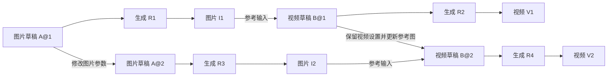

# Agent Chat 多工作流与素材引用设计

状态：主要功能已实现，最终真实验收进行中。多草稿聊天、画布、入库、迁移映射、离线恢复与清理已接入；Android 隔离四轮和备份恢复、实际官方画布与文件扩展已验证。真实四轮结构验收通过，历史来源偏移修复后三例通过；最新原生官方画布鉴权已通过无 Cookie 浏览器验收，Android 界面复验待 Mac 解锁。具体证据和剩余范围见 [实施记录](agent-conversation-workspace-implementation.md)。生产 V2 尚未启用。日期：2026-09-10。

本方案覆盖“生成图片 → 基于图片生成视频 → 回头调整图片 → 用新图片更新视频”，以及同一对话中的多图、多视频、历史版本和分支创作。依据当前工作区代码，包括已有但尚未提交的生成图片复用与模板切换补丁。

本文建议替代 `agent-workflow-drafts-design.md` 中“一个 Chat 只有一个当前草稿”的约束，沿用其中“草稿自动保存、用户明确决定入库”的原则。业务改造按第 13 节实施，具体进度另见 `agent-conversation-workspace-implementation.md`；本文描述目标契约，不作为实现完成证明。

## 阅读导引：这次重新设计改变什么

产品上，把同一段对话作为连续创作的容器。用户可以一直在这里生成图、用图做视频、回头改图，再决定是否把新图用于视频。图片和视频各自保留名称、历史、画布和保存目标，用户不需要手动切换 Agent 模式。

交互上，每次发送消息分别回答两个问题：**这次修改哪份创作，以及使用哪些参考素材。** 点击结果卡的“继续调整”确定修改目标；点击“用作参考”只选择输入。两者可以同时存在，例如“调整挥手视频，参考刚生成的海边图片”。没有明确选择时 Agent 查询上下文，多个候选都合理才展示选择卡。

技术上，将五种不同生命周期拆开：Session 保存对话集合，Draft 保存独立创作，Revision 保存不可变工作流版本，Run 保存一次实际生成，Asset 保存一份具体素材及来源。执行和引用都固定到具体对象，避免用“会话最后一次结果”决定后续行为。

| 用户动作 | 应改变的对象 | 保留的关系 |
| --- | --- | --- |
| 生成第一张图 | 图片草稿的新版本、一次生成和图片素材 | 记录该图来自哪次生成 |
| 用这张图生成视频 | 新视频草稿、一次生成和视频素材 | 视频引用这张具体图片 |
| 视频完成后回头改图 | 图片草稿的新版本、一次生成和新图 | 旧视频继续引用旧图 |
| 用新图更新视频 | 视频草稿的新版本，替换指定图片绑定并生成 | 旧视频与新视频各自保留输入和结果 |

评审时先看第 3 节的创作过程和第 9 节的手机交互；开发按第 4～8、10～12 节落实；第 14 节决定是否真正完成。第一版交付应贯通完整四轮流程，包含画布、入库、恢复与迁移，不能仅以新增数据库表作为完成条件。

## 1. 推荐方案与边界

**一个会话是一组相关创作的工作空间，包含多个独立工作流草稿、各自的不可变版本、生成记录和可引用素材。**

会话本身不再拥有一个代表全部创作状态的 `version`。图片和视频分别有自己的工作流；Agent 每次修改必须明确目标草稿，执行必须明确版本，引用必须明确素材。

首期采用这些确定规则：

| 问题 | 决策 |
| --- | --- |
| 图片变视频 | 新建视频草稿，绑定选中的图片素材；保留图片草稿 |
| 回头改图片 | 找到图片所属草稿和要修改的基础版本，在该草稿产生新版本 |
| 新图是否自动影响视频 | 已有视频固定关联原图；用户要求更新视频时，创建新的绑定和生成记录 |
| 一个草稿是否可以执行多次 | 可以；版本与生成次数独立计数 |
| 两个长期保留的创作方向 | 从指定版本分出另一份草稿，各自继续 |
| 对话是否并行执行多个任务 | 首期仍然每会话串行，复用现有调度边界 |
| 是否建设自动 DAG 编排平台 | 首期只记录依赖，并按本轮请求逐步执行；不做自动级联重跑 |
| 文件名是否是素材身份 | 不是；使用稳定 `assetId`，文件位置属于可变的存储记录 |
| 工作流何时进正式库 | 用户明确保存，目标固定为某份草稿的某个版本 |

这里的“调整图片”需要区分两种能力：修改原文生图参数重新生成，和把图片作为输入进行局部编辑/重绘。前者可以复用现有已支持模板；后者要求安装并适配相应工作流。本方案解决定位、引用和执行管理，不承诺现有 Z-Image/H3 模板具有任意图片编辑能力。

## 2. 原单草稿机制为何不足

下表描述本次改造针对的旧机制。工作区已有部分新实现，实际进度见实施记录；不能将下表视为全部现行代码的状态。

| 当前事实 | 代码位置 | 新方案中的变化 |
| --- | --- | --- |
| `Session.version`，`versions` 主键为 `(session_id, version)` | `gateway/agent/store.ts` | 版本归属独立草稿，主键改为 `(draft_id, revision)` |
| `get_workflow`、patch、validate 默认使用会话最新图 | `gateway/agent/service.ts` | 所有工作流操作显式传入 `draftId`，读取或执行再指定版本 |
| 最近补丁允许模板切换，仍写进同一版本链 | `create_model_workflow` / `create_from_template` | 不同创作目标创建不同草稿；模板替换成为草稿内的明确操作 |
| Task 的 `execution/result` 只保存最近一次执行 | `Task`、`checkExecution` | 每次执行单独记录 Run，Task 只保留当前 runId 和本轮操作进度 |
| 结果只有文件路径、媒体类型，当前采集还会去重并截断到 16 项 | `gateway/agent/media.ts` | 资产登记保留执行、输出节点和输出位置；UI 分页与资产登记分开 |
| 图片复用通过 `resultSeq + outputIndex` 和 receipt 定位 | 最近的 `prepare_output_image` | 迁移为稳定 assetId、存储位置及输入物化记录 |
| 保存来源与保存操作都挂在 Session 上 | `LibrarySaveService`、`librarySaveMachine.ts` | 归属某个草稿/版本，避免把视频更新到图片工作流文件 |
| 结果卡、历史面板只显示 V1/V2 | `ChatCards.tsx`、`VersionHistorySheet.tsx` | 显示所属创作、草稿版本、具体生成批次，按钮携带完整引用 |
| Chat 的画布入口当前指向已入库目标 | `ChatPage.tsx` | 打开选中草稿的画布，不再借用正式库对象 |

已有能力继续使用：Canvas codec、模板适配、版本条件写入、事件游标、模型上下文压缩、后台轮询、确认策略、提交不确定性核对、客户端条件入库与 ETag 冲突检测。

## 3. 用完整创作过程验证语义

为了避免把图片编号当作工作流版本号，下文中 A/B 是草稿，A@1 是版本，R1 是一次执行，I1/V1 是生成素材。



### 3.1 用户先生成图，再生成视频，再调整图

1. “生成一张猫的图片”：创建 A@1，提交 R1，获得 I1。
2. “用这张图生成挥手视频”：将 I1 作为明确选择，创建 B@1，提交 R2，获得 V1；B@1 的绑定指向 I1。
3. “回头把图片背景改成海边”：解析为图片草稿 A；确认实际基础版本后创建 A@2，执行 R3，获得 I2。B@1 和 R2 的输入引用仍为 I1。
4. “用新图更新刚才的视频，动作不变”：读取 B 的目标版本，仅替换指定参考绑定为 I2，创建 B@2，执行 R4。
5. 打开 V1 仍能看到 I1、A@1、B@1、R2；打开 V2 看到 I2、A@2、B@2、R4。

步骤 3 完成后可以提供“用新图更新视频”的轻操作入口。只有用户触发，或者其本轮原始请求已经包含更新视频，才提交下一次生成。

### 3.2 同一次执行产生多张图

R1 可以产生 I1、I2、I3，它们共享 A@1，但拥有不同 assetId 与输出位置。

“用第二张图生成视频”必须落实到 R1 的第二张图片，不能仅传 A@1 或“最新图片”。如果会话中有多个可能指代的三图批次，则展示候选批次/缩略图进行选择。

“再按相同参数出一张”需要明确随机种子语义：保持全部参数时新建 Run、复用版本；随机种子变化时先形成记录了新种子的 Revision，再执行。不能在提交时悄悄改种子。

### 3.3 从旧结果继续修改

假设 A 当前为第 5 版，用户在 A@2 的结果卡点击“继续调整”。请求固定 `draftId=A, sourceRevision=2`。

- 默认在 A 内产生 A@6，内容基于 A@2 加本次修改；A@3～A@5 仍可访问。
- 写入时校验 `expectedHeadRevision=5`，并记录 `sourceRevision=2` 与 `previousHeadRevision=5`。
- 不先恢复一次再修改一次；一次原子提交即可生成新版本，避免中间状态与多余版本。
- 用户说“另做一个方向，两种都留着”时，创建草稿 C@1，记录 `forkedFrom=A@2`，A 的 head 不改变。

“使用这张旧图片作为视频输入”只选择图片素材，不需要恢复或改变图片草稿的 head。

### 3.4 同一图片生成两个视频

“再做一版奔跑的视频，挥手版本也留着”：从 B 的指定版本分出 C，并复用 I1。两个视频草稿独立调整。

“换成奔跑动作”：通常在 B 内产生新版本，原挥手视频作为历史结果保留。只有用户要独立继续两个方向时才新增草稿，避免每条消息都产生一个草稿。

## 4. 数据模型与必须成立的约束

### 4.1 核心对象

| 对象 | 建议关键字段 | 含义 |
| --- | --- | --- |
| Session | `id, owner, name, schemaVersion, defaultContext?, previewPolicy, archivedAt?` | 对话与创作集合；不再持有工作流版本号 |
| Draft | `id, sessionId, name, outputKinds, headRevision, forkedFrom?, sourceRef?, archivedAt?` | 可独立继续的工作流草稿，界面称“图片 / 视频 / 名称” |
| Revision | `draftId, revision, canvas, bindings, sourceRevision?, previousHeadRevision?, summary, createdByTaskId?, createdAt` | 图与输入绑定的不可变快照 |
| Run | `id, sessionId, taskId, draftId, revision, serverId, state, submissionKey, promptId?, executionSnapshot, inputManifest, outputAssetIds, timestamps, diagnostic?` | 一次物理生成尝试，不同于一次聊天任务 |
| Asset | `id, sessionId, kind, origin, sourceRunId?, outputLocator?, sourceMessageSeq?, displayOrdinal, blobDigest?, metadata, captureState` | 一份上传或生成的具体素材 |
| Task | 沿用现有字段，增加 `requestContext, resolvedTargets, operationSteps, activeRunId?, waitingReason?` | 处理一条用户请求，可按顺序操作多个草稿和 Run |

`outputKinds` 可以包含 image/video/audio，不能用一个强制互斥的 mediaType 排除 H3 同时输出视频和音频。

数据库建议新增 `drafts`、`draft_revisions`、`runs`、`assets`、`asset_locations`、`asset_materializations`、`library_save_ops`、`library_asset_refs`；沿用 sessions/tasks/events/context/receipts。媒体字节写入持久化目录，不写入 SQLite 或模型消息。正式库引用需要独立保存，不能随会话级联删除。

关系约束在 SQL 和服务层同时落实：

- Revision 必须属于目标 Draft；Draft、Run、Asset 和 Task 的会话归属必须一致。
- `UNIQUE(draft_id, revision)`；`UNIQUE(submission_key)`；生成素材以 `(run_id, output_locator)` 唯一，保证重复轮询不重复登记。
- Run 的 `(draftId, revision)` 指向不可变快照，不跟随 Draft.headRevision。
- `assetId` 是素材身份；同字节可共享 blobDigest，但不同输出/上传行为保留各自来源。
- ready Asset 的内容摘要与来源不可改写；重新上传不同字节产生新 assetId，只有可用性、存储位置和展示名称可更新。
- 同名文件、相同 promptId 字符串或相同图片哈希都不能单独用于跨会话归属判断。
- 业务对象与对应事件、receipt 在一个 SQLite 事务中提交。事件用于展示和审计，业务表用于当前事实查询。

### 4.2 版本与素材绑定

工作流中的媒体输入使用结构化绑定：

```ts
interface AssetBinding {
  id: string;
  nodeId: string;
  inputName: string;          // 例如 LoadImage.image
  role: string;               // profile 声明的 reference_image / start_frame 等角色
  assetId: string;
}

interface InputManifestEntry {
  bindingId: string;
  assetId: string;
  blobDigest: string;
  serverId: string;
  materializedRef: { filename: string; subfolder: string; type: 'input' };
}
```

Revision 保存逻辑绑定；执行前解析绑定，在图副本上填入实际 loader 路径。执行快照同时保存实际 API prompt、与其一致的 canvas、输入清单和必要模型/节点环境摘要。历史执行的实际文件名不从当前环境反推。

参考角色由已适配模板声明，包含输入类型、数量、节点位置和语义约束，不能让模型任意填写 role。“参考图驱动”和“以图片为精确首帧”是不同能力；选择 H3 等模板时必须按实际适配能力响应，不能把前者承诺成后者。

Canvas 中存在绑定时，绑定是该媒体输入的权威值。画布换图必须通过素材选择器原子更新 binding 和显示值；普通 patch 工具不能只改字符串来绕过绑定。

导入工作流里尚未登记的文件路径显示为“待关联输入”。基于用户导入的准确路径登记/核验素材后才能执行；不能凭一个同名文件推断它就是历史原图。没有输入的完整工作流仍可直接编辑运行。

允许保存结构合法但输入未齐全的草稿；`validate_workflow` 区分结构错误与未满足的输入。正式执行要求全部可执行校验通过。需要拆分现有“提交版本必须通过全部执行校验”的实现，不能通过全局关闭校验来放行。

### 4.3 引用关系与“有新版本”的含义

依赖记录在具体 Revision/Run 与具体 Asset 之间，不保存 `latestImageOfDraftA` 这样的浮动指针。

“图片有了新结果”是可查询事实；“视频应当改用这张新图”是用户决定。界面可在同一已确认创作线出现新图片时提示“有新图片，可更新视频”，不把旧视频标成失效或错误。

草稿层面的 A→B→A 创作过程允许出现：例如先用图生成视频，再取视频帧做新图。只要每条输入边都指向已经存在的具体素材，按版本/执行展开后的依赖关系不形成未来引用循环。不能用草稿级 DAG 检查误拒绝这种合法流程。

## 5. Agent 如何判断这次要操作什么

### 5.1 分开“界面选中”与“本轮目标”

客户端当前展开的卡片、浏览的历史版本、选中的画布，仅影响本机界面。发送消息时把有意义的选择固化进 requestContext；任务创建后不跟随 UI 焦点变化。

Session.defaultContext 只是最近一次明确创作目标的提示，不能给写操作提供隐式对象。它可以在成功的创作动作后更新；仅浏览旧图不会修改另一设备的默认上下文。

```json
{
  "requestId": "uuid",
  "message": "把背景改成海边",
  "context": {
    "targetDraftId": "draft-image-a",
    "sourceRevision": 2,
    "selectedAssetIds": ["image-i2"],
    "replyToEventSeq": 145,
    "action": "edit_source"
  }
}
```

context 字段只在实际选择时出现。App 或模型给出的 ID 都必须校验会话归属、版本存在性和允许的动作；sourceRevision 与 targetDraftId 不匹配返回错误，不自动改选。

### 5.2 解析顺序与歧义

1. 用户这条消息的明确意图与结构化选中对象共同决定目标。两者冲突时不能静默优先某一边：例如选中视频卡却说“改原图”，应追溯其图片输入，或在多图输入时让用户选择。
2. 没有选择时，按明确名称、结果编号、回复的卡片及媒体类型查询候选。
3. 只有一个符合意图的目标时直接使用；“继续”“再亮一点”等短句可结合最近一次明确创作上下文。
4. 有多个合理候选，或必须看图才能理解“左边那个人”但当前模型没有视觉能力时，发出一次具体澄清。
5. 解析结果以 resolvedTargets/操作记录持久化；后续工具携带准确 ID，压缩历史后仍可核验。

不能声称服务端可以确定自然语言的真实意图。服务端能强制对象归属和版本条件，UI 的结构化选择能减少歧义，剩余选择质量需通过真实模型用例验证。

### 5.3 结果卡动作具有不同语义

| 动作 | 结构化含义 | 是否立即消耗 GPU |
| --- | --- | --- |
| 继续调整生成方式 | 定位 sourceRun 的 draft/revision，作为消息目标 | 否，用户发送具体要求后决定 |
| 用作参考 | 把 assetId 加入输入区，等待本轮用途 | 否 |
| 生成视频 | 锁定选中 image assetId，发出明确图生视频请求 | 是，遵循会话确认策略 |
| 查看当时工作流 | 打开 Run 固定的版本/执行快照 | 否 |
| 按原参数再生成 | 选择确定版本及输入，创建新的 Run | 是 |
| 另做一个方向 | 从指定 Revision 创建新 Draft | 否，后续是否生成依用户请求 |

对用户上传、没有 sourceRun 的图片，不展示“修改原生成参数”；可以“用作参考”。局部改图入口必须依据已适配能力显示。

### 5.4 模型上下文

稳定 system prompt 和工具 schema 继续使用。每步追加的 session state 包含：本轮请求上下文、已解析目标、当前操作步骤、相关草稿摘要/版本、选中素材与必要来源、运行状态和剩余预算。

不把所有草稿的完整图和所有图片放入每轮上下文。仅加载当前目标图，其他对象通过分页工具查询。压缩摘要保留 draftId、版本、runId、assetId、已完成动作和未完成动作；服务端事实表不依赖摘要完整性。

选中的生成图片也可以在 vision 开启时进入本轮视觉输入，沿用图片数量/字节预算与按任务缓存。视觉输入和 ComfyUI 参考输入独立：视觉失败不等于参考素材不可用；未发送的图片不能声称“已经看过”。

## 6. 素材从生成结果变成可靠输入

### 6.1 先登记身份，再持久化字节

成功执行后为每个输出登记 Asset，保留 `nodeId + outputField + itemIndex` 等稳定输出位置。图片网格的用户编号在登记时固定，不随懒加载、媒体筛选或去重变化。

当前 `collectMediaOutputs` 的 16 项限制只能继续作为单次界面/模型展示预算，不能作为永久登记上限。新解析器保留完整有界输出元数据并分页；超出服务端协议上限时标记 `outputsIncomplete`，保留原始响应供诊断，不能宣称所有结果均已登记。

建议新增 Gateway 持久化媒体目录，与 SQLite 一并挂载/备份。新生成的受支持图片在执行结束后立即进入后台收集任务：流式读取、校验实际媒体、读取尺寸、计算 SHA-256、临时文件写入后原子改名，再提交数据库关联。相同字节允许存储去重，来源关系保持独立。

素材状态为 `pending_capture / capturing / ready / missing / capture_failed / remote_only`。生成成功与素材收集成功分开：GPU 已成功时不得因为归档失败重跑 GPU；可以展示服务器预览，同时明确“参考素材仍在准备”或“未能保存参考素材”。

图片优先保证完整闭环。建议首期图片收集上限 20MB，沿用当前复用限制；视频/音频按服务器可配置上限收集，未支持或超过上限的内容为 remote_only，不承诺可恢复复用。可见预览不代表已经获得可靠的可引用字节。

对于新输出，立即收集能缩短源文件被覆盖的窗口，但不能证明采集前文件未被外部改写。使用隔离输出前缀、保存采集时间及校验摘要；不得宣称未知字节与原执行逐字节一致。历史迁移资产明确标为待核验来源。

### 6.2 执行前物化为 ComfyUI 输入

1. 从绑定的 assetId 取得已经确认的 blobDigest；pending 时等待收集，失败时阻止该次提交并报告原因。
2. 查找 `(assetId, blobDigest, serverId, loaderKind)` 对应的物化记录，状态为 `pending / preparing / ready / failed`。
3. 对首次或可能被外部清理的输入位置核验文件可用性和摘要。缺失时从持久化 blob 重建，不能仅根据旧 receipt 返回一个已失效路径。
4. 通过受信任的 Comfy Adapter 上传，使用服务端返回的实际名称，在图副本中填入 loader 值。
5. 保存实际路径、摘要和时间，完成校验后固定本次 Run 的输入清单。

已准备输入不得被系统用新内容覆盖。图片可以沿用最近补丁中带会话/素材标识的 input 根目录命名，以适配当前严格的 LoadImage 选项校验；不要求模型猜文件名。外部手工覆盖仍需核验，文件校验到 ComfyUI 打开之间也不宣称具有跨进程锁定保证。

媒体读写必须流式限额、支持取消和超时；存储容量不足会使素材准备失败，不悄悄换成低清图或另一张图。

`serverId` 使用 Gateway 管理的稳定连接身份，Run 固定该身份。ComfyUI 配置切换时不能把同名文件或旧 promptId 当成新服务器的内容；必须显式重新绑定并准备输入。URL 和认证密钥不由模型提供。

### 6.3 生命周期

- 草稿、历史执行和正式入库操作引用的素材标记为使用中；归档会话不立即清理文件。
- 首期不提供自动删除有引用素材的后台策略。磁盘不足时明确报错并允许用户管理占用。
- 永久清理会话是显式操作，先归档，再查看删除数量、保留来源、预计释放空间和阻塞原因。确认绑定准确的影响摘要；引用或会话变化后必须重新查看并确认。
- 清理前在同一事务保存操作记录、删除无入库依赖的会话数据并写入已清理标记，再删除无引用的受管 blob。保留正式库依赖及完整来源批次；其他会话共享的字节继续保留。
- 文件删除失败保留原操作，在归档列表显示待完成状态；刷新、服务重启后均可继续同一请求。完成后从会话列表移除，最小会话标记和已保留来源继续支持认证与重试。聊天读取和新写入返回 410；迟到请求接收完正文后再次检查状态。
- 永久清理不删除 ComfyUI 物化输入；清理影响只计算 Gateway 拥有且确认可删除的媒体副本。
- 只清理系统拥有的副本，绝不因删除聊天自动删除用户原始上传文件或一般 ComfyUI output 文件。
- 对未纳入系统追踪的外部工作流，无法证明其不依赖某个输入副本；首期不给此类 ComfyUI 输入做激进自动 GC。
- 第一期引用只允许本会话。跨会话复用以后通过明确导入动作创建当前会话 Asset，保留来源记录，不能任意引用别的会话 ID。

## 7. Agent 工具契约

采用草稿作用域的新工具契约，避免通过 `switch_current_workflow` 改全局指针再调用无目标工具。

| 工具 | 主要输入 | 作用 |
| --- | --- | --- |
| `plan_operations` | `steps: [{stepKey, kind, targetDraftId?, dependsOn?}]` | 登记或补充本轮有序动作，返回服务端分配的 operationId；登记本身不修改图、不运行 GPU |
| `list_drafts` | 媒体/名称筛选、cursor | 查会话内草稿摘要 |
| `get_workflow` | `draftId, revision?` | 读取一个明确工作流；省略版本仅表示该草稿 head |
| `list_versions` | `draftId, cursor` | 查某个草稿的历史 |
| `list_assets` / `get_asset` | kind/runId/draftId/cursor 或 assetId | 找到具体素材、状态与来源 |
| `list_runs` / `get_run` | draftId/cursor 或 runId | 查询生成历史和输入清单 |
| `create_workflow` | templateId、参数、名称、结构化 bindings、operationId | 新建独立草稿；复用现有模板构建器 |
| `edit_workflow` | `draftId, expectedHeadRevision, sourceRevision, operations, bindingChanges, operationId` | 一次事务提交内容与绑定，产生新 Revision |
| `fork_workflow` | `sourceDraftId, sourceRevision, name, operationId` | 创建独立方向，源草稿 head 不变 |
| `replace_workflow_template` | `draftId, expectedHeadRevision, templateId, bindings, reason, operationId` | 用户明确要求重建同一创作时替换模板，保留历史 |
| `restore_workflow` | `draftId, sourceRevision, expectedHeadRevision, operationId` | 单纯恢复，不生成；同样创建新 Revision |
| `validate_workflow` | `draftId, revision` | 检查结构、模型、绑定、素材及运行条件 |
| `submit_preview` | `draftId, revision, operationId` | 创建并推进一个 Run，固定全部输入 |
| `request_selection` | question、候选对象 ID、选择类型 | 记录 waiting_user 澄清，与 GPU 确认分别处理 |

环境查询与节点 schema 工具继续保留。`prepare_output_image` 的物化逻辑下沉服务层，模型只指定 Asset，不负责复制流程；素材准备进度仍以工具/执行事件显示。

operationId 是 Task 中持久化操作步骤的稳定标识。`plan_operations` 按 `(taskId, stepKey)` 幂等登记；同一步重复声明返回相同 ID，已开始/完成步骤的定义不能改写。依赖关系只允许指向同一 Task 的先前步骤，用于恢复和检查顺序，首期不自动执行整个计划。

每次写工具必须使用运行时已分配、类型/目标匹配的 operationId；首次接受参数后固定请求摘要，相同 ID 与相同参数返回同一结果，不同参数返回冲突。校验失败后需要修改参数时，通过新修复步骤关联原步骤。operationId 及其状态随每步 session state 返回，不只依赖模型新生成的 toolCallId。新建草稿、版本、素材、Run 都必须具有幂等边界。

这可以保证程序恢复和同一动作重放不重复写入/提交；不能数学上保证模型不会错误规划一个全新的重复动作。完成检查、任务预算与真实模型验收仍要检查不必要生成，不能把提交幂等宣传为理解用户意图的保证。

同一步修改同一草稿的多个工具调用按工具顺序串行处理；版本条件不匹配时返回当前 head 和冲突摘要。不能让并行网络回包决定谁是“当前工作流”。

`request_selection` 支持图片候选卡、版本候选和自由补充。回复携带 questionId 和候选 ID，回答后恢复原任务；用户拒绝、停止或重复答复均有明确状态。沿用 waiting_user，但 `waitingReason=selection` 与 `preview_approval` 是不同联合类型。

## 8. 执行、确认与故障恢复

### 8.1 Run 取代 Task 内唯一 execution

一次 Task 可依次创建 R1（图片）和 R2（视频）；每个 Run 都独立落库。修改工作流不等于执行完成，旧的成功 Run 也不代表本轮要求已经完成。

建议 Run 状态：`preparing → awaiting_approval? → submitting → queued/running → succeeded/failed`；提交结果不确定进入 `reconciling`，无法确认则 `unknown`。未提交前可 cancelled；提交后用户停止 Agent，只停止后续动作，Run 独立继续核对实际状态。

Task 取消后也要轮询已提交 Run，记录迟到的成功结果并标注“停止后完成”，但不恢复模型循环、不执行后续视频步骤。不能把“Agent 已停止”误报为“GPU 已停止”。

### 8.2 执行顺序

1. 固定草稿、版本和本轮操作 ID，登记 preparing Run；校验绑定归属。
2. 收集/物化输入、编译实际 prompt 与 canvas、做执行校验，生成待执行快照和 inputManifest；计算覆盖目标版本、逻辑参数和素材摘要的 approvalDigest。
3. 会话策略为 confirm 时，展示该具体 Run 的名称、版本、参考缩略图、尺寸/时长与必要开销提示；auto 则继续。
4. 已确认的图、输入资产和生成参数不能再变；变化必须创建新的请求并重新适用确认策略。仅修复同字节输入位置时可重新编译路径，approvalDigest 保持相同，须保留准备快照与修复记录。
5. 在事务中固定最终不可变 executionSnapshot/inputManifest，写入 submitting 和唯一 submissionKey，再向 ComfyUI 提交，extra_data 写入 sessionId/taskId/draftId/revision/runId/submissionKey。进入 submitting 后不能修改快照。
6. 回包丢失时查询对应服务器队列/历史，唯一匹配才接管；未知则等待核对/人工处理，不重新提交同一生成。
7. 完成时原子记录运行结果、资产登记和事件，异步准备素材；恢复 Task 的下一步。

确认卡回答只对对应 runId/questionId 生效；过期或已回答返回 409。App 重开后从持久化记录恢复卡片，不能凭聊天文本重建一次提交。

### 8.3 串行与部分完成

首期每会话只允许一个活动 Task；活动期间相关草稿的手工修改提交统一拒绝，UI 可查看、选中和编辑本地副本，但不能写入。跨设备写入同时校验 head，保留冲突设备的本地修改。

“改图并更新视频”按本轮要求串行执行：图片成功后固定产物，再修改视频绑定。图片失败或产出多图无法唯一选择时，视频阶段停止等待；不会用旧图顶替。

图片成功、视频失败属于部分完成。进度保存为可恢复的 operationSteps（完成的 runId 和选定 assetId 也保存），用户“继续生成视频”时复用已成功图片。上下文重试不能重复整条链。

现有模型调用次数、预览次数和任务截止时间继续生效。长链按阶段报告；达到预算时保留已完成结果和待完成动作。首期不后台无限续跑，也不因为增加多草稿就提高默认 GPU 预算。

## 9. 手机端交互

保留“对话 / 工作流 / 作品”三个主入口。会话内增加创作选择器，不新增全局“项目管理”入口。

```text
猫咪海边短片                         [创作 2] [更多]

图片 · 猫咪海报
[图片 I2]
[继续调整] [生成视频] [更多]

视频 · 挥手短片
[视频 V1]
参考：猫咪海报 · 图片 I1           [查看来源]
[继续调整] [用新图更新] [更多]

本次调整：猫咪海报 · 图片 I2        [×]
参考素材：[图片缩略图]              [×]
[描述想调整的内容……]                  [发送]
```

设计要求：

- 普通用户主要看到名称、图片和用途。draftId、assetId、图哈希等保留在内部/诊断中。
- 结果卡区分“工作流第 2 版”和“第 3 次生成”，多图批次再显示“图 2/4”；不能继续只展示全局 V2。
- 图片与视频同时存在时，可通过“创作”面板切换，面板显示每个草稿的最新结果、草稿已修改未生成状态及运行进度。
- 点击历史卡片后，输入区出现目标标签；切换浏览不自动提交、不自动恢复旧版本。
- 版本历史按草稿展示，来源关系在结果详情中展开。历史结果按钮始终指向产生它的实际版本。
- 参考素材和“修改谁”是两个不同区域，防止选择一张图片后把视频修改请求错路由成改图片。
- 澄清卡直接展示可选缩略图，手机无需抄写图片文件名或版本号。
- 每个草稿都有独立“草稿已保存 / 有新修改 / 已入库”状态；会话级状态只表示任务与同步状态。
- 所有新增文案覆盖 zh/en/ja/ko，沿用现有认证媒体组件和 transcript 工具生命周期展示。

画布路由建议为 `/chat/:sessionId/drafts/:draftId/canvas`；历史查看带明确 revision。编辑器复用已有节点 UI，注入草稿存储接口，不能绕道创建正式工作流。若首期只交付只读画布，必须在验收范围和界面明确标记，不能把它称为可编辑草稿画布。

### 9.1 画布编辑、同步与冲突恢复

进入画布时固定打开的草稿与基础版本，同时读取该草稿的当前 head。工作副本按服务器、会话、草稿及打开的版本隔离，保存 canvas 与 bindings；不能把它临时插入正式工作流库。仅打开、浏览或切换画布模式不产生新版本。

生产 Web 构建生成独立 Service Worker，预缓存同一构建的 HTML、JS、CSS、图标及 manifest。安装逐文件校验摘要，不允许将部署切换期间不同版本的文件混成一个可用缓存。只接管明确的应用页面和构建资源，不缓存认证 API、聊天响应或用户媒体；开发服务器不注册，原生应用继续使用随包资源。需要支持 Service Worker 的安全来源（HTTPS 或 localhost），缓存不可用时在画布明确显示状态。

升级遵循浏览器等待阶段，不自动 skipWaiting 或刷新正在编辑的页面。旧页面继续使用其完整构建，关闭该站点的所有页面后重开采用新版本。缓存被清理后，联网启动可以按原构建摘要重新准备；失败保留现有缓存及本机草稿。字体样式为非阻塞可选资源，离线使用系统字体。

在线打开时缓存对应服务器的节点参数定义与草稿来源上下文，以便连接失败后重新打开已有本机副本。缓存参数定义用于编辑和展示，不能作为服务端当前环境的执行校验依据。本机模式暂停同步与生成；重连核对服务器身份，保留原请求与版本条件。画布 API 请求携带固定服务器身份，由 Gateway 在读写入口检查，避免同一 URL 换成另一服务器后误写入。没有完整缓存或本机副本时明确说明无法离线打开。

界面区分三个动作：编辑内容自动保存到本机并在条件允许时同步为草稿版本；“生成”先同步，再对确认的具体版本创建 Run；“保存到工作流库”另行固定版本和目标文件。草稿已保存不表示已经生成，也不表示已入库。

| 状态 | 界面与恢复行为 |
| --- | --- |
| 已同步 | 显示草稿版本，可按此版本生成 |
| 有本地修改 / 同步中 | 先保存本地检查点；生成等待对应修改同步成功 |
| 断网或会话任务执行中 | 保留本地修改并说明暂未同步；恢复网络或任务结束后尝试同步 |
| 保存回包丢失 | 使用原 requestId 和原版本条件核对同一次保存，再提交后续修改 |
| 其他设备推进了 head | 保留本地内容，展示服务器新版本与本地修改；不自动覆盖或合并节点图 |
| 服务端明确拒绝内容 | 显示可修复原因；保留被拒请求以供核对，修改后以新请求提交 |

发生版本冲突时，提供“保留本地修改为另一份创作”和“查看服务器版本”两个主要入口。另存方向必须保存当前本地 canvas/bindings，并记录基础版本来源，不能误用服务器历史版本代替未同步内容。放弃本地修改是明确操作，执行前提示会丢失哪些未同步改动。

“放弃本机修改”先持久化同步暂停意图，再将原待保存/另存请求交给服务器核对。服务器在事务中检查完整请求摘要与既有回执：已提交的版本和另存创作保留；未提交请求写入持久取消记录，即使旧 POST 迟到也不能再次执行。全部核对成功后，本机副本采用服务器当前版本；网络错误、磁盘错误或另一窗口的 CAS 冲突均保留本机内容和原请求，允许重新核对。恢复备份保留未完成放弃意图，导入不会恢复已取消请求的自动同步。此操作不创建 Revision 或 Run，不删除历史或其他副本。已因图内容校验失败的请求也可以取消，无须先修复图。

返回聊天前尝试保存本地检查点。网络失败时允许用户带着“仅保存在此设备”的状态离开，重新打开恢复原工作副本；此时不得把本地内容标记为服务器版本，聊天生成仍只能使用明确的已同步版本。若本地存储也失败，保留编辑器内容并提供导出恢复文件的入口，不能提示“已保存”。

恢复备份可从本会话的创作面板导入。导入先核对服务器身份、会话归属、基础版本内容和引用素材身份，再写入独立的本机工作副本；不覆盖原窗口副本。导入后的副本暂停同步，用户查看后明确确认才核对原待保存/另存请求。备份中的 requestId、sourceRevision 与 expectedHeadRevision 保持原值，不通过采用服务器最新 head 来消除冲突。文件不能作为请求已失败或已成功的证明；原结果仍需向服务端核对。恢复备份不包含媒体字节，不能替代素材持久化与会话备份。

官方画布与手机画布共享同一工作副本和素材绑定。进入官方画布前检测执行接管能力，所有生成统一经过会话 Run 流程；扩展不支持时给出升级或切回手机画布的入口。素材输入通过同一选择器更新，禁止两个画布分别维护互不一致的引用。

## 10. API 与事件

所有接口沿用 `/api/gateway/agent`、现有认证和共享管理员工作空间。下表描述目标契约，部分已接入；具体实现与验收状态以实施记录为准。

| 接口 | 行为 |
| --- | --- |
| `GET /status` | 增加 `agentSchemaVersion` 与 `multiDraft / assetReferences / selectionCards` 能力字段 |
| `GET /sessions/:sid` | 会话元数据、活动任务、有限草稿摘要与事件页；不再携带一条全局 versions 数组 |
| `GET/POST /sessions/:sid/cleanup` | GET 返回清理影响和已有操作；POST 携带 requestId、planToken 和明确确认，首次按已审核影响清理，后续仅继续原操作 |
| `GET/POST /sessions/:sid/drafts` | 分页列出/创建草稿；创建支持模板或已有工作流快照 |
| `GET/PATCH /sessions/:sid/drafts/:did` | 元数据、head、重命名/归档；head 不允许直接 PATCH |
| `GET/POST /sessions/:sid/drafts/:did/versions` | 分页历史/提交条件写入，携带 expectedHeadRevision、sourceRevision、完整内容与 bindings、requestId |
| `POST /sessions/:sid/drafts/:did/discard-local` | 显式放弃本机副本：核对并取消原 pending/fork 请求，返回当前 Revision 和已提交结果；不提交新生成 |
| `GET /sessions/:sid/drafts/:did/versions/:rev` | 读取不可变版本 |
| `POST /sessions/:sid/drafts/:did/restore`、`/fork` | 显式历史操作，均幂等；fork 返回新 draftId |
| `GET /sessions/:sid/assets`、`/assets/:aid` | 查询素材和来源，分页/过滤 |
| `POST /sessions/:sid/assets` | 登记用户明确上传的准确 ComfyUI 文件引用，返回 assetId 与收集状态 |
| `GET /sessions/:sid/runs`、`/runs/:rid` | 查询生成状态、输入和输出，分页/过滤 |
| `POST /sessions/:sid/runs` | 画布或原参数再生成的明确动作，固定 draftId/revision/requestId；创建独立 Run 并遵循会话确认策略，无需模型重新解释 |
| `POST /sessions/:sid/messages` | `{requestId, message, context?, assetIds?}`；纯选图动作也允许有效结构化请求 |
| `POST /sessions/:sid/selections/:qid/answer` | 回答持久化澄清，含 taskId 和选中 ID/补充说明 |
| `POST /sessions/:sid/approve` | 确认固定 runId 的请求，替代仅 version 的定位 |
| `POST /sessions/:sid/drafts/:did/library-saves` | 登记固定版本的入库意图；后续接口推进该 op 的状态 |

素材字节通过带身份验证的 Gateway 媒体路由读取，不向模型或事件暴露带密钥 URL。客户端现有上传流程可以先保留，上传后调用登记接口；上传文件与本轮生成结果统一使用 assetId。

新增业务事件包括 `draft_created`、`revision_created`、`asset_registered`、`asset_ready`、`run_state`、`selection_requested/resolved`、`library_save_state`。事件载荷携带所需 draftId/revision/runId/assetId；序号仍使用现有单调 seq。

快照在一致性读事务中取得对象状态与事件高水位，返回的事件页有确定边界；客户端按 seq 去重，按完整对象 ID 更新，不让旧页覆盖较新状态。所有草稿、版本、素材、运行列表必须分页，不能沿用“取最近 100 条”充当全量。

## 11. 工作流库、作品与来源追溯

`sourceRef`、最近一次入库与正在保存的操作移到 Draft 作用域。保存面板固定 `{draftId, revision}`；默认目标来自这份 Draft 的记录，不继承会话里另一份草稿的目标。

客户端继续作为正式 ComfyUI workflow 文件的唯一写入方。保存意图由 Gateway 登记；复用当前 pending/applying/reconciling/succeeded/conflict/failed 状态机，仍使用 expected ETag 和 save_op_id 核对。

图内容比较需要纳入逻辑 bindings：单纯相同 nodes/links 但引用素材不同，不能显示“已与工作流一致”。建议保存 intent 的 `revisionDigest`（规范化图+绑定身份/摘要）和实际导出内容的 `exportGraphHash`，不要把它们与整个文件 ETag 混用。

导出前在目标服务器准备参考输入，把实际路径写入导出 canvas，并在 extra 中附加来源和输入说明。保存工作流 JSON 不等于打包全部媒体；在另一台没有这些输入的服务器导入时必须显示缺失参考，不能只凭内部 assetId 宣称可直接执行。

入库操作同时 pin 使用到的受管输入，避免清理会话时破坏已保存流程。跨草稿更新同一个正式库文件仍由 ETag 保证竞争检测；首期可继续限制每会话一次活动入库操作。

作品入口可以按 Run/Asset 展示会话生成内容，与现有 ComfyUI 历史作品以 `serverId + promptId + outputLocator` 关联去重；没有 Agent 来源的作品继续使用既有展示方式。查看“使用的图片 / 生成工作流 / 后续使用”从业务引用查询，不解析聊天文字。

## 12. 迁移与最近补丁的去向

### 12.1 部署与事务边界

沿用个人使用、设备统一升级的前提，不维护旧新客户端同时写入。Gateway 新增 schema 版本检查；旧客户端写请求返回明确升级要求，不把旧 `version` 自动映射到“当前选中草稿”。

迁移工具先做只读盘点和 SQLite 一致性备份；短暂停止新任务，等待活动 GPU/入库操作结束或由用户显式处理。无法确认的提交不能在迁移时当作未提交重新运行。数据库结构和映射在事务中迁移，媒体收集作为之后可恢复的后台任务。

回滚要求数据库与应用版本成对恢复；新 schema 一旦接受写入，不允许直接启动旧版本 Gateway。方案不包含自动删除旧表来节约空间。

### 12.2 旧会话、版本和任务

1. 没有工作流版本的会话保留为空创作集合。
2. 每个已有版本的会话先创建一份 `legacy` 来源草稿，原版本 1…N 原样保留，建立 `(oldSessionId, oldVersion) → (draftId, revision)` 映射。
3. 旧会话可能已经被最近补丁切换过图片/视频模板。迁移时不根据提示词或节点相似度猜测独立创作链；保持完整历史，用户选择明确旧结果继续时，可从该版本创建对应独立草稿并记录 fork 来源。
4. `sourceRef / lastLibrarySave` 按有证据的具体旧版本映射；来源不明则保留 legacy 元数据，不默认让新视频草稿继承图片入库目标。
5. 从完整事件表按已记录 attemptId，或准确的 taskId/promptId/version 关联回填 Run，不能只遍历最近 100 个 Task。缺少可靠关联的旧记录标注 `legacy_incomplete`，保留原始事件，不编造成功提交。
6. 旧事件 seq 不变，transcript adapter 通过映射读取新引用。旧版本链接可只读重定向到明确草稿版本；旧写接口拒绝。
7. 旧 Task 消息和压缩摘要只作为历史文本保留；新任务的 state 提供映射后的事实，不执行摘要中的旧工具动作。

迁移后的快照在旧事件响应中附加 `workspaceLegacy`，保留数据库里的原事件和 seq。旧 `state/result` 指向同一 Run 时仅显示一张持续更新的生成卡；工作流事件和旧附件分别读取版本、素材映射。无明确映射的结果保留文字及不完整提示，不以文件名或当前 head 补造对象。

`GET /sessions/:sid/versions/:version` 仅按迁移映射返回固定 Revision 和 `readOnly: true`。界面支持 `/chat/:id/versions/:version` 与 `?version=` / `?legacyVersion=` 的只读查看；查看不会设置本轮调整目标。缺失映射返回 404，不能自动打开最新版。缺少完整执行快照的旧 Run 禁用“按原参数再生成”，仍可查看保存的工作流、明确继续调整或分出新方向。旧素材的当前可读字节与历史原文件是否一致另行标注，不能由成功下载推断已证实历史身份。

### 12.3 旧素材与临时图片复制记录

旧 `(sessionId, resultSeq, outputIndex)` 确定性映射到 assetId，保留输出位置证据。原采集逻辑已经丢失的节点位置/超过 16 项的输出不能靠迁移恢复；可从仍可读取的准确 ComfyUI 历史补充，无法确认则标记信息不完整。

最近补丁的 `output-image:<resultSeq>:<index>` receipt 可以导入为候选物化位置，但必须核验实际字节后才 ready。旧源文件与复制件不同、已被覆盖或无法确认时不自动合并，不把“现在同名的文件”说成原图。

旧附件也登记为 Asset，保留准确输入路径和用户消息来源。历史媒体收集不阻塞整个数据库迁移； unavailable/legacy 状态对用户可见，后续选择时再完成核验或请用户重新提供。

### 12.4 哪些实现保留，哪些替换

| 最近改动 | 处理 |
| --- | --- |
| 受认证图片读取、流式大小限制、uploadImage | 保留，成为资产服务基础能力 |
| 成功结果查询 | 作为迁移和旧事件适配工具；新事实查询走 Run/Asset |
| 按输出位置复用图片 | 保留逻辑，入口改为 assetId，增加 blob 与可用性核验 |
| 会话级 baseVersion 模板切换 | 新 runtime 中移除，分解为创建 Draft 或显式替换指定 Draft 模板 |
| 在 stepState 注入最近生成结果 | 改为注入本轮相关草稿与素材摘要 |
| 图→视频两轮测试 | 保留场景，升级断言为两个草稿与真实引用关系 |

## 13. 实施顺序与交付边界

这是一次贯穿存储、Runtime 与 UI 的改造，建议按以下顺序实施，每阶段保持可验证。第一版正式启用需要完成 P0～P5，不能只交付多草稿数据库就宣布该 case 已解决。

| 阶段 | 主要内容与代码位置 | 完成条件 |
| --- | --- | --- |
| P0：契约与迁移 | 新增 domain types、schema migration；调整 `gateway/agent/store.ts`，补独立 Draft/Revision/Run/Asset 仓储 | 旧库完整回填、可回滚；身份/外键/幂等/分页测试通过 |
| P1：素材与执行 | 新增 asset service、materializer、run service；改 `media.ts`、`comfyAdapter.ts`、scheduler | 生成输出可登记、持久化、重新物化；Run 独立恢复，失败不重复 GPU |
| P2：Agent 工具与定位 | 改 `service.ts`、`prompts.ts`、`context.ts`；持久化 operationSteps、selection | 三轮回头改图、第四轮更新视频，多候选选择与部分恢复全部跑通 |
| P3：API 与聊天 UI | 改 `routes.ts`、`AgentApi.ts`、`useSessionSnapshot`、`ChatPage`、`ChatCards`、`ChatComposer`、transcript、历史面板；新增创作/素材选择组件 | 手机端可选准确结果、明确目标、回到正确工作流，无需输入技术 ID |
| P4：画布与入库 | 改 `WorkflowEditor` 的存储边界、`LibrarySaveService`、状态行和保存面板；四语文案 | 图片/视频分别编辑和入库，画布修改与聊天版本一致，库目标不串写 |
| P5：真实验收 | 隔离会话、实际安装模型、浏览器与 Android，执行下表用例 | 新版验收完成后再启用生产数据迁移与发布 |

Runtime 仍可使用一个 AgentService 对外编排，但业务模块分成工作流仓储/服务、素材服务、Run 服务和请求上下文解析。不要继续把所有新 SQL、素材 IO 与工具实现堆进同一个 tools() 函数。

沿用 `npm run test:agent`、`test:agent-ui`、`test:transcript`、`test:gateway`、`build`、`lint`，新增聚焦回归；真实模型用例单独统计。Mock 验证数据和工具契约，不能代替自然语言目标解析与真实图片/视频执行验收。

首期暂不交付：同一会话并行 GPU 编排、上游变化自动级联重跑、跨会话隐式引用、任意节点/子图支持、未适配的局部编辑与视频剪辑、整套创作链一键导出为单个 ComfyUI workflow。

## 14. 验收矩阵

| 场景 | 必须验证的事实 |
| --- | --- |
| 图 → 视频 → 改图 → 更新视频 | 只有两份主要草稿；图片、视频版本各自推进；旧视频始终指向旧图 |
| 仅改图、未要求更新视频 | 图片出现新 Run，视频无新增提交 |
| 选中旧视频后“改它使用的原图” | 从该 Run 输入清单定位原图，不能改用最新图片 |
| 多图批次“使用第二张” | 正确 assetId，图片序号不因分页/音频输出变化 |
| 两个图片草稿后“改图片” | 出现候选选择，无错误草稿写入或 GPU 提交 |
| 历史 A@2 基础上修改，head 已到 A@5 | A@6 基于 2，写入校验 5；3～5 保留 |
| 另做一个方向 | 新 draftId，forkedFrom 准确，源 head 不变 |
| 同一版本再次生成 | 新 runId；固定参数与输入；没有无意义版本，改变种子则有新版本 |
| 原图生成方式调整与局部重绘 | 选择实际受支持能力，不能把重生成宣称为局部编辑成功 |
| 只上传一张图，没有生成工作流 | 可作参考，不出现虚假的原工作流编辑入口 |
| 图成功、视频失败后“继续” | 复用原成功 image assetId，不重复生成图片 |
| Task 停止但 GPU 后来成功 | 保存迟到结果，不执行下一阶段，不宣称 GPU 被取消 |
| 预览确认后重启 | 恢复相同 Run、图版本、输入和确认状态，无重复提交 |
| 提交回包丢失 | 唯一 submissionKey 核对；未知不能直接 POST 第二次 |
| input 副本丢失而受管 blob 存在 | 重新物化同摘要图片，更新位置记录，不替换素材身份 |
| 源图与缓存都不可用 | 明确缺失；生成视频不得使用任意替代图 |
| 同名文件内容被替换 | 摘要不符被识别；历史素材来源不被重写 |
| 图片收集超时/磁盘满 | GPU 结果仍准确显示成功；素材状态失败；不反复生成来修复 IO |
| 超过一页素材/100 个版本 | 可分页找到指定旧对象，历史压缩后仍可引用 |
| 选择卡与另一设备操作并存 | 回答绑定 questionId；重复/过期回答不产生新操作 |
| 手机查看旧图，浏览器正在发消息 | 浏览动作不更改浏览器任务目标；版本冲突被检测 |
| 画布更换参考图 | canvas 与 binding 原子更新，执行输入清单与 UI 一致 |
| 画布断网、刷新与保存回包丢失 | 恢复本地内容，原请求幂等核对；不丢修改、不重复产生版本或 Run |
| 画布与另一设备同时修改 | 冲突保留双方内容；另存方向包含未同步的本地修改及准确基础来源 |
| 官方画布与手机画布切换 | 内容与引用一致，浏览不产生空版本；生成统一进入会话 Run 流程 |
| 图片、视频分别保存到库 | 各自正确目标、版本和素材；更新一方不覆盖另一方文件 |
| 旧混合模板会话迁移 | 原版本/事件/结果保持可追溯；分离时记录准确来源，不猜历史分支 |
| ComfyUI 服务器切换 | 旧 Run 不误核对新服务器；素材使用前明确重新准备 |

真实模型验收建议每个关键自然语言 case 重复至少 3 次，记录目标选择正确率、澄清次数、无意 GPU 提交次数与工具修复次数。允许合理澄清；错误目标写入、错误图片绑定和重复提交必须为零。视频画面和主体一致性另行人工评价，不能由程序执行成功推断。

## 15. 取舍

继续补一个“切回历史版本”工具改动最小，但会话仍只有一条版本链，独立入库、多个方向、批量输出引用和来源追溯仍然容易混淆。

要求用户为图片和视频分别开新对话可以绕开单草稿限制，但破坏这次要求的连续创作过程，还需要解决跨对话素材引用。

完整自动依赖编排会进一步涉及运行计划、自动失效传播、预算控制和并行调度。当前需求的关键是准确选中对象与保留具体引用，先采用多草稿、不可变版本、独立 Run/Asset 和显式更新，能够覆盖反复往返调整，同时继续使用现有单会话串行执行器。

推荐按本方案落地，并以第 14 节作为实现验收标准。技术身份、执行证据和文件可用性由程序保证；创作目标和视觉效果由用户意图与实际模型能力决定。
