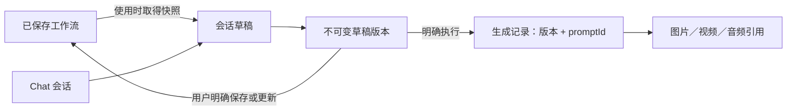

# Chat 与工作流库解耦设计方案

状态：待评审，仅设计，未修改业务实现。本版为第二稿，修订依据见第 12 节。

## 1. 建议采用的方案

**会话草稿自动保存，工作流入库由用户明确决定；生成历史独立保留。**

用户可以围绕同一个文生图流程开启很多对话，每个对话保留自己的提示词、参考图和调整过程，而工作流库只保留值得复用的流程。保存过程不要求用户理解 JSON、数据库或云同步。

三个主要入口保持不变：**对话 / 工作流 / 作品**。不增加一个与工作流库并列的“草稿库”；草稿从所属对话进入。

| 对象 | 用途 | 何时创建 | 展示位置 |
|---|---|---|---|
| Chat | 用户意图、消息、附件和操作过程 | 首次发送消息，或首次确认编辑草稿 | 对话列表 |
| 会话草稿 | 本次创作正在使用的节点图及参数 | 选择已有流程开始编辑，或 Agent 首次构建成功 | 对话内、草稿画布 |
| 已保存工作流 | 长期复用、分享和直接编辑的流程 | 用户点击保存到工作流库，或通过原有导入/新建流程保存 | 工作流库 |
| 生成记录 | 某次执行的版本、promptId、状态和输出引用 | 每次明确提交执行 | 对话结果卡、作品详情 |

草稿不是“不可靠的临时数据”：联网时保存在 Gateway，支持重新打开、跨设备继续和历史恢复。这里减少的是工作流库里的条目，不是通过丢弃记录来减少占用。

**草稿的服务器数据源就是现有的 `sessions + versions`。** 它已经是不可变版本加 `baseVersion` 条件写入，不再另建一套草稿表。

**入库的写入方是客户端，保存意图记录在 Gateway。** App 已有带 `expected_etag` 的条件保存接口和 409 冲突识别；Gateway 只保存“正在保存什么、目标是谁、结果如何”，不直接写 ComfyUI 工作流文件。这样不会出现 Gateway 与 App 云同步两个写入方争夺同一批文件的问题。

**首期范围：一个 Chat 只有一个当前草稿，可以执行多次、保存多个版本；多个 Chat 可以使用同一个已保存工作流，但不共享可变草稿。**

## 2. 当前实现中需要改变的地方

以下依据本地当前工作区，而不是把历史设计文档当作实现事实。

### 2.1 需要改变的行为

| 当前行为 | 位置 | 问题 | 调整 |
|---|---|---|---|
| `ChatPage` 在会话版本变化时调用 `mirrorVersion` | `ChatPage.tsx` 镜像 effect | 只要形成工作流，就自动进入工作流库 | 移除 Chat 到正式库的自动写入 |
| `mirrorVersion` 调用 `addWorkflow/updateWorkflow` | `mirror.ts` | 触发 `emitWorkflowLocalChange`，进一步上传到 ComfyUI 工作流目录 | 删除该模块；草稿只走会话版本接口 |
| `Workflow.agent.sessionId` 记录单个会话，选择器直接跳回旧会话 | `binding.ts`、`ChatPage.tsx` 选择器 | 从工作流使用助手时难以独立开始新创作 | 改为来源关系；提供“使用”和“相关对话”两个入口 |
| 发消息前 `importCanvasIfChanged` 把库中编辑导入会话 | `mirror.ts`、`ChatPage.send` | 正式流程与实验中的草稿相互影响 | 草稿编辑只写草稿；正式流程更新必须有明确保存动作 |
| `save_workflow_version` 与 `POST /sessions/:id/save` 设置 `saved` 标记 | `service.ts`、`routes.ts` | “保留版本”“存入库”“同步完成”容易被混为一谈 | 区分草稿持久化、版本标记和正式入库 |
| `sessionTitle` 有绑定时返回工作流名；`createSession` 用 `workflow?.name ?? name` | `binding.ts`、`service.ts` | 不同创作会话难以区分，重命名相互牵连 | 会话名称与工作流名称独立，两处都要改 |
| 云下载不回读文件内的 `workflow_id` | `CloudWorkflowSyncService.ts` 下载函数 | 同一文件在不同设备 id 不同；改名后 id 变化 | 下载时采纳文件内 id，见 5.2 |
| 会话、版本、任务列表各截断 100 条 | `store.ts` | 较老版本看起来消失 | 明确分页 |
| `deleteSession` 级联删除全部版本、任务、事件 | `store.ts` | 生成记录随会话消失 | 首期只做归档，删除语义推后 |

### 2.2 已有、可直接复用的能力

这些不需要新写，实现时不要重复：

| 能力 | 位置 | 说明 |
|---|---|---|
| 会话版本条件写入 | `store.commitVersion` | `baseVersion` 不匹配返回 409 |
| 手工导入版本时拒绝活动任务 | `service.importVersion` | 已检查活动任务并校验画布结构 |
| 恢复历史版本 | `service.restore` + `POST /sessions/:id/restore` | 同样有 `baseVersion` 与活动任务检查 |
| 创建会话时携带画布与来源引用 | `POST /sessions` | 已接受 `canvas` 与 `workflow` 字段，改名为 `sourceRef` 即可 |
| 条件保存与冲突识别 | 扩展 `save_workflow` 的 `expected_etag`、`ComfyFileService.saveWorkflow` | 409 与 `workflow_conflict` 已被识别为 `conflict` |
| 原子写入 | 扩展 `atomic_write_workflow` | 临时文件加 `os.replace` |
| 执行归属 | `task.execution = { attempt, version, promptId }` | 版本不可变，执行快照已经稳定 |
| 事件游标 | `GET /sessions/:id?after=` | 事件已经分页，其他列表照此处理 |

当前工作区另有共享会话 owner 的改动：已认证设备属于同一用户空间。新方案沿用该身份策略，不重新引入“每设备一份草稿”；手机和浏览器同时编辑时靠版本冲突检测。该身份改动仍需独立验收，本方案不把它视为已经上线的事实。

只隐藏列表中的自动生成项不够：后台同步仍会上传它们。也不建议仅在现有 `Workflow` 上增加 `hidden` 字段，因为漏改一个同步或导出入口，就可能重新把草稿当成正式工作流。

## 3. 用户操作流程

### 3.1 从空白对话生成

1. 点击“新对话”，不创建任何工作流库条目。
2. 发送“生成一张森林照片”。Agent 根据环境选择可用模板，在本会话建立草稿。
3. 执行成功后展示结果，草稿自动保存；工作流库数量不变。
4. 继续说“换成黄昏”“改为横图”，调整本会话草稿并产生后续生成记录。
5. 需要复用这一流程时，点击“保存到工作流库”，填写名称，创建一条正式工作流。
6. 保存之后继续聊天，也只修改草稿；不会持续覆盖刚保存的工作流。

纯聊天、询问模型环境、只上传附件，都不因发送消息而强制创建节点图。

### 3.2 使用已有工作流

工作流卡片的主操作为“使用”：进入新的 Chat，并把来源工作流的一个确定版本作为草稿起点。选择阶段可以预览；首次发消息或首次确认编辑时才落地会话与草稿，避免误点就产生空会话。

例如使用“Z-Image 标准出图”分别制作海报和头像：两个对话各有一份草稿，互不影响，工作流库仍只有“Z-Image 标准出图”。复制会话草稿不等于复制工作流库文件。

卡片的其他操作保留“编辑工作流”，并增加“相关对话”。“相关对话”列出使用过该流程的会话，用户选择继续哪一个，不再通过单一 `sessionId` 强制跳转。

从库中直接点击“编辑工作流”仍沿用现有正式编辑体验；该编辑器的正常保存和云同步不属于 Chat 自动入库，需要继续保留。

### 3.3 保存到工作流库

聊天页提供明确的保存面板：

| 情况 | 可用动作 | 结果 |
|---|---|---|
| 没有来源或保存目标 | 保存为新工作流 | 新增一个库条目 |
| 来源仍存在、可更新 | 更新「来源名称」 / 另存为新工作流 | 用户明确选择更新对象或新建 |
| 本会话已经保存过 | 优先展示更新「上次保存目标」；同时允许另存 | 重复保存默认复用保存目标，不不断生成副本 |
| 草稿与保存目标内容一致 | 显示“已与工作流一致” | 不创建新对象或无意义的新发布记录 |
| 目标已被其他设备改动 | 显示冲突，允许查看当前版本或明确另存 | 不自动覆盖、不自动产生“冲突副本” |
| 目标已删除 | 保存为新工作流 | 不悄悄重建原文件 |
| 另一设备正在保存本会话 | 显示“另一设备正在保存”，可等待或核对 | 不并行发起第二个保存操作 |

点击保存时固定一个已同步的草稿版本。即使后续会话产生新版本，本次保存的内容也不改变。界面分别显示“版本 5 已存入工作流库”和“当前草稿还有新修改”，避免把旧版本保存成功误报为整个当前草稿已保存。

“更新来源”面板说明：更新会影响以后使用该工作流的用户操作，已经开始的其他会话仍使用各自的草稿，不跟随覆盖。

### 3.4 在画布里修改草稿

聊天页的“画布”打开 `/chat/:id/canvas`，标题明确为“本会话草稿”，不会先添加一个正式库条目来获得编辑器入口。

编辑器复用节点画布能力，但通过不同的数据接口加载和保存：

- 正式编辑器 `/workflow/:id` → 工作流库及原有云同步。
- 草稿编辑器 `/chat/:id/canvas` → 会话版本接口及独立本地缓存。

`WorkflowEditor.tsx` 目前在五处直接调用 IndexedDB 的 `addWorkflow/updateWorkflow/loadAllWorkflows`，并通过 `useWorkflowStorage` 读写库。改造方式是抽出一个 `WorkflowDocumentStore` 接口（load、save、name、canSave），正式编辑器注入 IndexedDB 实现，草稿编辑器注入会话版本实现。不复制整个编辑器。

草稿编辑建议在用户操作停止约 800ms 后合并保存；返回聊天、执行或入库前立即保存一次。只有图内容发生有效变化才提交新版本；平移、缩放等纯视图状态保存在本地，不产生版本。

同一会话有 Agent 任务时，首期画布可查看但不允许提交修改（`importVersion` 已经拒绝）。另一个设备已经提交新版本时，本机保存返回 409 并保留本地修改，不采用“最后写入覆盖”。首期不实现节点级自动合并。

**A1 阶段的过渡形态：** 若草稿画布未能与取消镜像同期完成，A1 的“画布”按钮只打开当前版本的只读视图；需要手工编辑时先“保存到工作流库”，再在库中编辑并“使用”。这是明确的过渡形态，不是把草稿写进库。

### 3.5 查看结果、恢复和再生成

结果卡片提供“再生成”“基于这次结果继续”和“查看当时工作流”。

- **再生成**：使用选中执行记录对应的版本；再次运行必须由用户明确触发。
- **基于这次结果继续**：把当时版本恢复为本会话的新草稿版本（现有 `restore`），后续修改不影响原记录。
- **查看当时工作流**：打开只读快照，不新增工作流库条目。

记录可用于复用图和参数，但不承诺模型、插件或随机计算环境变化后逐像素一致。附件或模型文件已不存在时，明确列出缺失项，不用当前文件替代过去的输入。

## 4. 信息展示与文案

聊天页以创作结果为主，版本细节放在展开区域：

```text
森林海报                       [画布] [更多]
使用：Z-Image 标准出图

……对话与生成结果……

[保存到工作流库]
草稿已保存

[输入消息 / 添加附件]                  [发送]
```

建议使用的状态文案：

| 状态 | 用户看到的文案 |
|---|---|
| 草稿已被 Gateway 确认 | 草稿已保存 |
| 修改暂存本机但未上传 | 已保存在此设备，等待同步 |
| 正在存入正式库 | 正在保存到工作流库… |
| 指定版本入库完成 | 已保存到「工作流名称」 |
| 后续草稿与保存内容不同 | 草稿有新修改 |
| 正式库写入失败 | 未能保存到工作流库，草稿已保留 |
| 保存结果待核对 | 上次保存未确认，正在核对 |
| 另一设备先修改草稿 | 此对话有新版本，本机修改已保留 |

正常页面不把“草稿未入库”显示成警告，也不在每次生成后弹保存对话框。会话标题由首条消息或用户重命名决定；来源流程名称作为辅助信息，不覆盖会话标题。

## 5. 数据关系与保存边界



### 5.1 复用当前 Gateway 数据

`sessions + versions` 正式定义为草稿的服务器数据源；`version=0` 表示尚未创建节点图。

| 数据 | 建议字段或调整 |
|---|---|
| Session | 增加 `schemaVersion`、`workspaceMode: draft/legacy`、`sourceRef?`、`lastLibrarySave?`、`librarySaveOp?`、`archivedAt?`；`name` 独立；旧 `workflow` 字段改名保留为 `legacyWorkflow` 作为迁移证据 |
| sourceRef | `{ serverId, workflowId, filename, name, etag }`；来源记录，不是自动同步绑定 |
| lastLibrarySave | `{ serverId, workflowId, filename, draftVersion, graphHash, etag, opId, at }` |
| librarySaveOp | 当前或最近一次保存操作：`{ opId, mode: create/update, draftVersion, graphHash, target, expectedEtag, state, startedBy, startedAt, result? }` |
| DraftVersion | 复用 `versions`；完整 canvas 不可变，保留摘要、创建来源、创建时间 |
| Run | 首期不建表，从事件派生，见 5.4 |

`sourceRef`、`lastLibrarySave` 与图内容快照相互独立。来源文件后来被重命名、删除或修改，不会使会话草稿无法继续使用。

正式工作流仍以现有 ComfyUI 工作流 JSON 文件为内容来源，不建设第二套彼此竞争的工作流库。App IndexedDB 是正式库缓存，另设草稿缓存，禁止让草稿进入 `loadAllWorkflows()` 和 `CloudWorkflowSyncService` 的上传扫描。

### 5.2 工作流身份

跨设备不能把本地 IndexedDB ID 当作唯一稳定身份。使用 `serverId + workflowId`，文件名只是定位信息。`serverId` 取规范化后的 ComfyUI 服务器地址。

**现状必须先修正。** 上传时 `workflowContentForCloud` 会把本机 `workflow.id` 写进 `extra.comfy_mobile_cloud.workflow_id`，但下载时用 `cached?.id || stableCloudId(filename)`，从不回读该字段。结果是同一文件在两台设备上 id 不同，改名后哈希派生的 id 也变。`sourceRef` 与 `lastLibrarySave` 都依赖稳定 id，因此下面三条是阶段 A 的前置任务：

1. **下载时采纳文件内 id。** 顺序为 `cached?.id` → 文件内 `workflow_id` → `stableCloudId(filename)`。文件内 id 与本地另一条不同文件名的记录重复时（用户在服务器复制了文件），本条退回文件名派生 id，并标记 `cloud.identityConflict`，列表提示“需要重新关联”。
2. **重命名保留 id，明确另存生成新 id。** 旧文件缺少 id 时先由本地索引按文件名关联，不在只读浏览时偷偷重写 JSON；下一次用户保存时补齐。
3. **`extra.comfy_mobile_cloud` 升到 `schema: 2`**，增加 `save_op_id`（最近一次入库操作 id），供回包丢失后核对；见第 6 节。

重复 ID 或无法确认的外部重命名应提示重新关联，不能靠同名或相似图自动合并。

### 5.3 版本、哈希和 ETag

三种标识各管一件事，不能互相替代：

- **草稿版本号**：检测同一会话上的并发写入，使用 `baseVersion` 条件更新。已有。
- **文件 ETag**：检测正式库目标是否已被其他客户端修改。它是扩展端对整个文件字节做的 SHA-256，包含上传时注入的 `extra` 元数据（name、tags、`comfy_mobile_cloud`），所以不能拿来判断“图内容是否一致”。
- **图内容哈希 `graphHash`**：只对 `nodes` 和 `links` 做规范化 JSON 后 SHA-256，用于“已与工作流一致”判断和重试核对。现有 `hashCanvas` 已经按这个范围取键排序哈希，只需把 64 位 FNV 换成 SHA-256 并在 Gateway 与 App 共用同一实现。

执行快照不需要额外记录种子：Gateway 的 `canvasToPrompt` 明确跳过 UI 侧的种子随机化，seed 是画布 widget 值，已经固定在不可变版本里。提交给 ComfyUI 的 prompt 可以随时从版本重新推导。

初版沿用完整 canvas 快照，优先保证可靠性；后续才考虑按内容哈希去重。不要为了减少占用立即删除中间版本或生成记录。

### 5.4 生成记录从事件派生

Chat 的一次任务可能包含多次执行，`task.execution` 和 `task.result` 只保留最后一次，但每次执行已经写入 `state`（含 `promptId`、`version`）与 `result`/`execution_error` 事件。首期不新建 runs 表：

- `submit_preview` 写入的 `state` 事件和最终 `result` 事件都增加 `attempt` 字段。
- `GET /sessions/:id/runs` 按 `attempt` 聚合事件得到执行记录：会话/任务 id、版本、promptId、状态、输出引用、提交与完成时间。
- 沿用提交回包丢失后的核对逻辑，不能重新提交一次来“确认”。

事件量增长到影响查询时再落表，届时用同一份聚合逻辑做一次性回填。

## 6. API、同步和 Agent 行为

接口名是方案建议；“现状”列标明哪些已经存在。

| 操作 | 接口建议 | 现状 | 约束 |
|---|---|---|---|
| 从已有流程开启新会话 | `POST /sessions` 携带 `sourceRef` 与 `canvas` | 已接受 `canvas` 与 `workflow`，改名 | 本地未同步流程可提交 canvas，但 `sourceRef` 只能指向真实存在的云端文件 |
| 保存手工草稿 | `POST /sessions/:id/versions` | 已有；已要求 `baseVersion`，活动任务返回 409 | 增加 `requestId` 幂等：同一 `requestId` 重试返回原版本 |
| 恢复历史版本 | `POST /sessions/:id/restore` | 已有 | 不变 |
| 记录保存意图与结果 | `PATCH /sessions/:id` 写 `librarySaveOp` / `lastLibrarySave` | `PATCH` 已有，字段新增 | 状态迁移由 Gateway 校验，见下 |
| 草稿画布 | 复用 `GET /sessions/:id/versions/:v` 与 `POST …/versions` | 已有 | 不调用正式库 add/update |
| 相关对话 | `GET /sessions?source=…` 或 `?target=…` | 列表已有，筛选新增 | 游标分页 |
| 生成历史 | `GET /sessions/:id/runs` | 新增，事件派生 | 分页 |
| 归档 | `PATCH /sessions/:id` 设置 `archivedAt` | 字段新增 | 不删除版本或输出文件 |
| 列表分页 | `GET /sessions`、`GET /sessions/:id/versions` 增加游标 | 目前截断 100 | 事件接口已有 `after`，照此处理 |
| 能力声明 | `GET /status` 返回 `draftWorkspace: 1` | `transcriptProtocol` 已有 | 不复用 transcript 协议号 |

`save_workflow_version` 工具和 `POST /sessions/:id/save` 兼容期保留，仅表示“标记一个草稿版本”。

### 6.1 正式入库：意图在 Gateway，写入在客户端

流程：

1. **固定版本并登记意图。** 客户端选定 `draftVersion`，计算 `graphHash`，生成 `opId`，`PATCH` 会话写入 `librarySaveOp = { state: 'pending', … }`。新建模式在此时确定目标文件名；更新模式携带目标 id 与 `expectedEtag`。Gateway 拒绝在已有 `pending/applying/reconciling` 操作时登记第二个操作，其他设备据此显示“另一设备正在保存”。
2. **条件写入文件。** 状态改为 `applying`，客户端调用扩展的 `save_workflow`：新建用 `overwrite=false`，更新用 `expected_etag`。写入内容的 `extra.comfy_mobile_cloud` 带上 `workflow_id` 与 `save_op_id`。
3. **记录结果。** 成功后 `PATCH` 写入 `lastLibrarySave` 并把操作置为 `succeeded`；409 置为 `conflict`；其他错误置为 `failed`。
4. **刷新缓存。** 客户端把新文件写入 IndexedDB 正式库缓存，`cloud.dirty=false`、`etag` 取回包值，不触发第二次上传。

回包丢失或应用被杀：任何设备打开该会话看到 `applying`，进入 `reconciling`：下载目标文件，若 `save_op_id` 等于本操作 id 且 `graphHash` 一致则视为成功，否则视为目标已被后续操作修改，置 `conflict` 并保留待用户处理。不盲目重复覆盖。

幂等规则：

- 同一 `opId`、不同请求体返回 409；相同请求返回原操作。
- 新建目标文件名在操作创建时确定，不在每次重试时重新生成副本名。新建时目标已存在且 `save_op_id` 不是本操作，属于命名冲突，让用户改名，不自动加后缀。
- 这个入口不复用现有云同步中“409 后自动另存 conflict 文件”的逻辑。

与现有云同步的交互必须写进实现：

- **墓碑。** 本机若有同名文件的待同步删除记录，登记意图时先清除该墓碑，否则下次同步会把刚保存的文件删掉。
- **Outbox。** 入库写入不经过 `CloudWorkflowOutbox`，成功后直接写缓存；避免被当成脏数据再上传一次。
- **同名本地条目。** 本机若已有相同文件名但不同 id 的缓存条目，先按 5.2 的规则关联，再决定是新建还是更新。

扩展端 `save_workflow` 从 ETag 检查到 `os.replace` 之间没有 `await`，在 aiohttp 单事件循环下已经串行；实施时补一条注释和一个并发测试，不需要另加锁。外部进程直接修改文件的并发不作为无条件原子性保证。

后续若多设备同时保存的场景变多，可以把第 2 步移到 Gateway 执行，字段和状态机不变。首期不做。

### 6.2 Agent 的“保存”与用户保存分开

Agent 可以构建、修改、校验和按用户授权执行草稿，但默认不能把文件写入正式工作流库。

现有 `save_workflow_version` 在兼容期仅表示“标记一个草稿版本”，其 `saved` 事件不再显示成“已存入工作流库”。新工具和界面可逐步改称“保留此版本”；草稿持久化本来就不依赖模型再调用一次保存工具。

首期用户说“把这个保存成常用流程”时，助手给出带名称的保存操作卡，由用户点击最终的保存目标。这是一次明确的产品操作，不需要再增加第二层同义确认。自动生成后不弹此卡，也不能把“生成成功”推断成“要求入库”。

## 7. 多设备、离线与数据生命周期

同一用户在手机和浏览器看到相同会话草稿；草稿的服务器确认版本是准绳。另一个设备编辑正式来源文件不会自动替换当前草稿。需要采用新版来源时，用户点击“从来源更新草稿”，保留旧版本并建立新版本。

离线时允许缓存文字和画布修改，显示“仅保存在此设备”。重连后按基础版本提交；冲突保留本地恢复副本供用户处理，该副本属于草稿缓存，不自动进入工作流库。离线时不自动排队执行生成或更新正式来源，避免重连后发生用户没有预期的副作用。

默认对话管理提供“归档”，保留草稿、生成记录与附件引用。删除正式工作流不删除会话；归档会话不删除正式工作流。

**永久删除推到 D 阶段。** 作品库读取的是 ComfyUI 输出目录，Gateway 无法知道某个输出是否仍被保留，因此“删除会话但保留作品快照”在现有架构下无法可靠判断。首期只上线归档，不增加自动清理输出文件或附件的任务；现有 `deleteSession` 保留给显式的“删除会话”确认框，文案改为说明生成记录会一起删除。

## 8. 现有数据如何过渡

### 8.1 保守保留，不自动清理旧工作流

现有库条目不论是否由旧版自动创建，都先视为用户已持有的资产。不能仅凭名称、`agent` 字段、节点数量或图相似度判断它“多余”并删除。

旧的“自动创建条目”可在后续提供人工整理工具，预览来源、关联会话和差异后由用户选择保留、归档或删除；不纳入首期自动迁移。

### 8.2 旧会话迁移由新客户端完成

旧绑定的证据分散在两端：Gateway 有 `session.workflow`，各设备 IndexedDB 有 `Workflow.agent.{sessionId, mirroredVersion, mirroredHash}`。Gateway 单独无法判断“最后镜像的是哪一版”，所以迁移在新客户端首次打开旧会话时执行，可重复：

1. Gateway 启动时把没有 `workspaceMode` 的会话标为 `legacy`，`workflow` 改名 `legacyWorkflow`，其余不动。
2. 新客户端打开 `legacy` 会话：用 `legacyWorkflow` 在本地库里解析绑定条目；条目存在且 `agent.sessionId` 等于本会话，则 `sourceRef` 指向它。
3. 若条目的 `agent.mirroredHash` 等于会话最新版本的 `graphHash`，写入 `lastLibrarySave = { draftVersion: mirroredVersion, … }`；不等则只写 `sourceRef`，界面显示“草稿有新修改”，由用户决定从哪一份继续。
4. `PATCH` 把 `workspaceMode` 置为 `draft`，并清除本地条目上的 `agent` 绑定。原 `legacyWorkflow` 保留作为证据。
5. 条目不存在（已删除或在别的设备）时只保留 `legacyWorkflow`，会话按无来源的草稿处理；不重建库条目。

### 8.3 旧客户端写入的双向约束

只更新新 App 不够：旧 APK/浏览器仍可能读取共享会话后执行自动镜像和云上传。约束要覆盖两个方向：

- **旧客户端读新会话。** 新客户端请求携带 `X-Agent-Protocol: draft`。没有该声明的请求访问 `draft` 会话时，快照、版本读取一律返回 426 与升级提示，旧客户端拿不到可镜像的数据。
- **旧客户端创建 legacy 会话。** Gateway 增加配置 `agentLegacySessions: allow | deny`。发布初期为 `allow`，此时旧客户端仍会自动入库；确认新版覆盖后切到 `deny`，无声明的创建请求返回 426。在切到 `deny` 之前，不把“不会自动增加工作流”作为已完成的验收结论。

发布顺序：后端能力与迁移 → 新 Web/APK → 观察 → `agentLegacySessions=deny`。

回滚保留数据库和新草稿，不降级转换为库条目。首期应有服务端开关停止创建新模式会话；旧版客户端访问已有新模式会话时给出升级提示，不能靠回退 UI 把草稿重新镜像进库。

## 9. 分阶段实施

| 阶段 | 交付范围 | 完成标准 |
|---|---|---|
| A1：保存边界（首个可发布版本） | 5.2 身份采纳；取消镜像、导入与单会话绑定；会话字段与名称独立；“使用”入口；保存面板与 6.1 入库链路；版本列表分页；能力声明与 8.3 双向约束；8.2 迁移 | 多开生成类对话不会增加库文件；保存一次只产生一个目标；旧客户端被约束后库数量可验收 |
| A2：草稿画布 | `WorkflowDocumentStore` 接口、`/chat/:id/canvas`、草稿本地缓存与冲突恢复 | 编辑只写会话版本；不新增 IndexedDB 正式工作流 |
| B：历史与关系 | 事件派生的执行记录、“相关对话”、结果继续创作、归档、会话列表分页 | 多会话隔离，多设备可继续；历史引用不随当前草稿变化 |
| C：清理与整理 | 旧条目人工整理工具、`legacyWorkflow` 与 `save` 兼容路径下线、Web/APK 联合回归 | 原有资产无损；兼容代码可删除 |
| D：后续优化 | 永久删除语义、存储去重、命名/标签建议、多草稿会话、Gateway 侧写入 | 以实际使用反馈决定 |

A1 单独发布是可接受的：它已经解决“库被自动填满”这个核心问题，且 3.4 给出了没有草稿画布时的过渡形态。A2 应紧随其后。

主要实现位置：

- `src/components/agent/ChatPage.tsx`、`binding.ts`：删除 `mirror.ts`，解除自动镜像和单会话绑定，接入草稿状态、保存面板与迁移。
- `src/components/agent/ChatHeader.tsx`、`ChatCards.tsx`、`WorkflowPickerSheet.tsx`、`VersionHistorySheet.tsx`：来源、保存目标、草稿历史和结果操作。
- `src/infrastructure/sync/CloudWorkflowSyncService.ts`、`CloudWorkflowOutbox.ts`、`IndexedDBWorkflowService.ts`：下载采纳 id、`schema: 2`、入库写缓存不走 outbox、墓碑清理；草稿缓存不进入扫描。
- 新增 `src/infrastructure/library/LibrarySaveService.ts`：6.1 的状态机、条件写入与核对。
- `src/App.tsx`、`WorkflowEditor.tsx`、`useWorkflowStorage.ts`：`WorkflowDocumentStore` 接口与草稿画布路由（A2）。
- `gateway/agent/store.ts`、`service.ts`、`routes.ts`、`AgentApi.ts`：会话字段、`librarySaveOp` 状态校验、`requestId` 幂等、分页、事件 `attempt`、runs 派生、协议声明与 `agentLegacySessions`。
- `gateway/auth.js`、`server.js`：共享 owner 改动独立验收。
- `comfy-mobile-ui-api-extension/handlers/workflow_handler.py`：并发注释与测试；不改接口。
- 四种语言文案、绑定/同步回归和真实 Android/API 用例同步调整。

## 10. 验收用例

| 用例 | 必须满足 |
|---|---|
| 新建 20 个聊天，仅咨询或上传附件 | 正式库条目数和服务器工作流文件数不变 |
| 新建 20 个会话，各生成一次 | 有 20 份会话草稿和对应执行记录，正式库数量不变 |
| 同一流程用于两个 Chat，分别修改提示词和输入图 | 两份草稿独立；正式来源的 ETag 不变 |
| 生成后关闭 App，从浏览器继续 | 草稿与版本恢复，未发生自动入库 |
| 打开草稿画布、编辑、返回 Chat（A2） | 图同步到该会话，不新增 IndexedDB 正式工作流 |
| 双击“保存为新工作流”、超时重试、Gateway 重启、App 被杀后重开 | 同一操作只产生一个库条目；状态可核对 |
| 入库完成后再次聊天修改 | 正式库不被自动覆盖，界面显示草稿有新修改 |
| A/B 两台设备同时更新同一正式工作流 | 一方成功，另一方明确冲突；不产生自动 conflict 副本 |
| A 设备保存进行中，B 设备打开同一会话 | B 显示“另一设备正在保存”，不能发起第二个操作 |
| 两台设备编辑同一草稿 | 旧 baseVersion 被拒绝，本地修改不丢失 |
| 同一文件在两台设备下载 | 两台设备的 workflowId 相同；`sourceRef` 可互认 |
| 服务器上复制一个工作流文件后同步 | 副本被标记需要重新关联，不与原件合并 |
| 本机有同名文件的待删除墓碑时保存到库 | 文件保存成功，下次同步不删除它 |
| Agent 活动中修改草稿或恢复版本 | 被阻止；已固定的历史版本可在协议允许时独立保存 |
| 输入“保存”与工具 `save_workflow_version` | 不隐式写入正式库；真实入库有独立操作结果 |
| 恢复历史或重复生成 | 不新增库条目；真正使用选中版本 |
| 来源更新、重命名或删除 | 已有草稿仍可读取；没有错误关联、覆盖或自动复活 |
| 迁移旧会话，存在本地未同步修改 | 所有版本与旧库条目保留，冲突有明确恢复路径 |
| 旧 APK 打开新协议会话 | 提示升级，不能触发旧版自动镜像写入 |
| `agentLegacySessions=deny` 后旧 APK 新建会话 | 返回升级提示，不创建会话 |
| 归档会话、删除库条目 | 不级联删除另一方或共享附件 |
| 超过 100 个会话/版本/记录 | 分页可访问完整历史，无静默截断 |

指标建议：观察“新建会话数 / 新增库条目数”“保存操作产生的重复条目数”“草稿恢复失败数”“冲突覆盖次数”“reconciling 停留超过 1 分钟的操作数”。前两者用于确认产品效果；重复保存生成副本、静默覆盖和已确认草稿丢失应为 0。

## 11. 设计依据与待确认范围

ComfyUI 官方界面区分生成队列/历史与已保存工作流；本方案借鉴这种分工，但“Chat 草稿”的交互与存储是本 App 的产品设计，不宣称是 ComfyUI 官方指定的唯一最佳实践。

- [ComfyUI 官方界面说明](https://support.comfy.org/articles/7675456845-the-comfyui-interface)
- 当前代码：`ChatPage.tsx`、`mirror.ts`、`binding.ts`、`CloudWorkflowSyncService.ts`、`IndexedDBWorkflowService.ts`、`gateway/agent/store.ts`、`service.ts`、ComfyUI 扩展 `workflow_handler.py`。
- 历史设计：`docs/agent-chat-ux-redesign.md`、`docs/agent-chat-ux-redesign-plan.md`。本方案建议替换其中“一对一自动绑定并镜像”的决策；其余导航、对话展示和后台执行能力继续复用。

建议评审时先确认五项产品决策：

1. 草稿自动保存但不自动入库。
2. 多个 Chat 复用同一来源而保持草稿隔离。
3. 首期入库由明确按钮操作完成。
4. 旧条目一律保留且默认只归档会话。
5. 入库写入方为客户端，保存意图记录在 Gateway；A1 可在没有草稿画布的情况下先发布。

确认后再拆分实现任务，本文件不代表已经修改或上线这些行为。

## 12. 修订记录

第二稿相对第一稿的改动，均来自对当前工作区代码的核对：

- **身份前提修正。** 第一稿假设 `extra.comfy_mobile_cloud.workflow_id` 可直接沿用；实际该字段只写不读，下载用文件名派生 id。5.2 改为把“下载采纳 id”列为前置任务，并定义重复 id 的处理。
- **入库写入方改为客户端。** 第一稿新建 Gateway 适配层写 ComfyUI 文件，会与 App 云同步形成两个写入方，且未处理墓碑与 outbox。6.1 改为意图记在 Gateway、条件写入在客户端，并列出与现有同步的交互规则。
- **区分已有与新增。** `importVersion` 的 `baseVersion` 与活动任务检查、`restore`、`POST /sessions` 携带画布、扩展的 ETag 与原子写入都已存在。2.2 与第 6 节表格加了“现状”列。
- **执行快照简化。** seed 固定在不可变版本里，Gateway 不做运行时随机化；删去“提交前解析种子”的要求。runs 改为从事件派生，首期不建表。
- **哈希与 ETag 分工明确。** 文件 ETag 含 `extra` 元数据，不能用于内容一致性判断；`graphHash` 只算 nodes/links。
- **旧客户端约束补齐反方向。** 增加 `agentLegacySessions` 开关，说明在切到 `deny` 前不能宣称验收通过。
- **首期范围收缩。** A 拆成 A1（可发布）与 A2（草稿画布），并给出 A1 的过渡形态；永久删除语义推到 D。
- **实现位置补齐。** 会话名独立需要改 `binding.ts` 与 `service.ts`；新增 `LibrarySaveService`；扩展端并发保护改为注释加测试。
